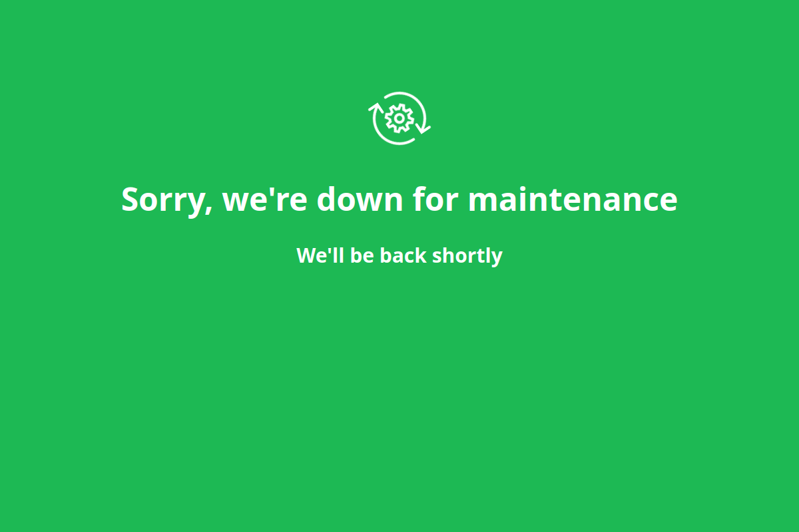
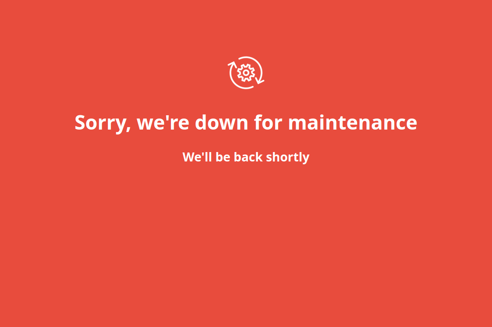
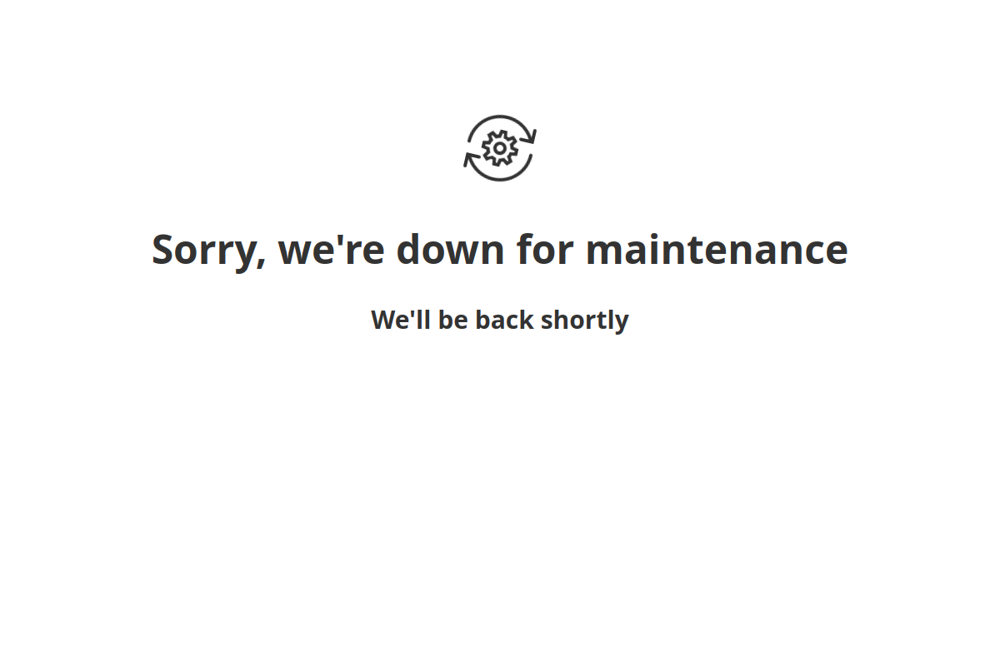
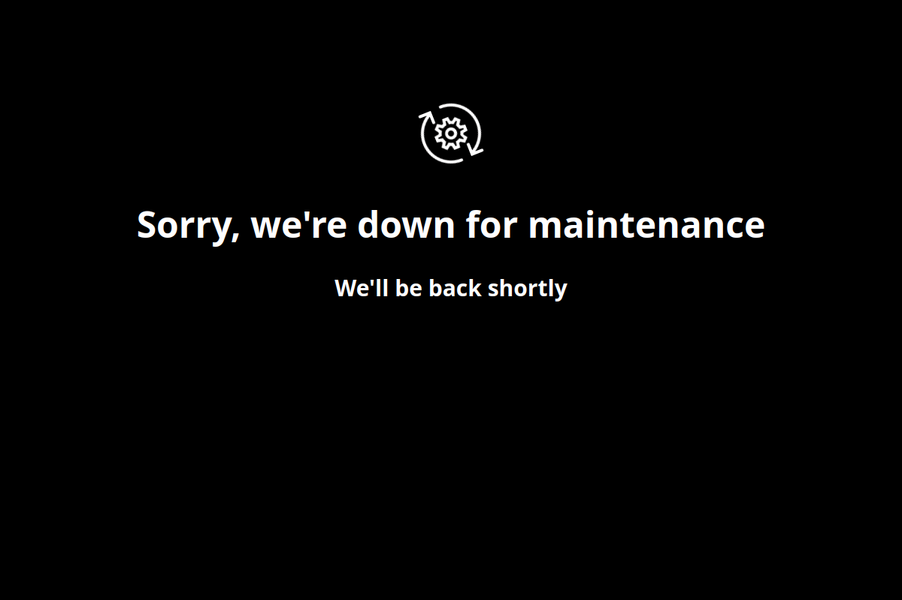

# Simple maintenance page

Single file maintenance page

Demo: https://shvchk.github.io/simple-maintenance-page

## Installation

```sh
wget https://github.com/shvchk/simple-maintenance-page/raw/master/index.html
```


## Themes

You can set theme with `body` element class. Default is Green, i.e. `theme-green` class.

Available themes:
- Light: `theme-light`
- Dark: `theme-dark`
- Green: `theme-green`
- Red: `theme-red`


## Preview

Green theme:


Red theme:


Light theme:


Dark theme:



## License
- Icons: [Icons8.com](https://icons8.com)
